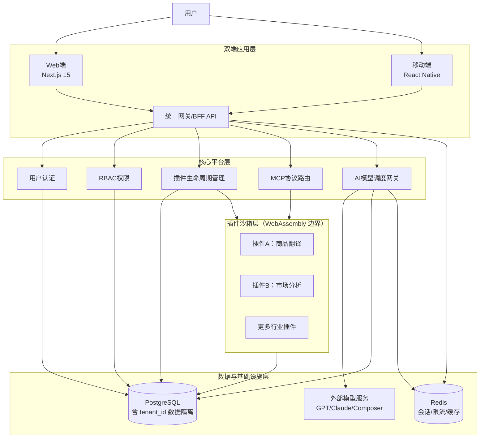
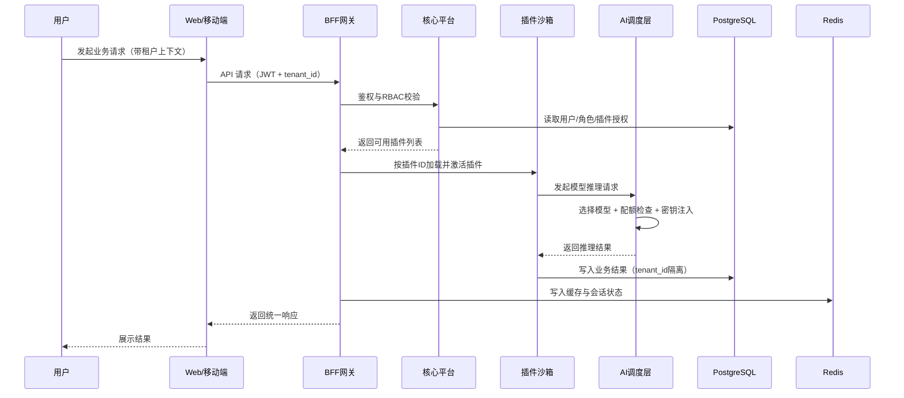
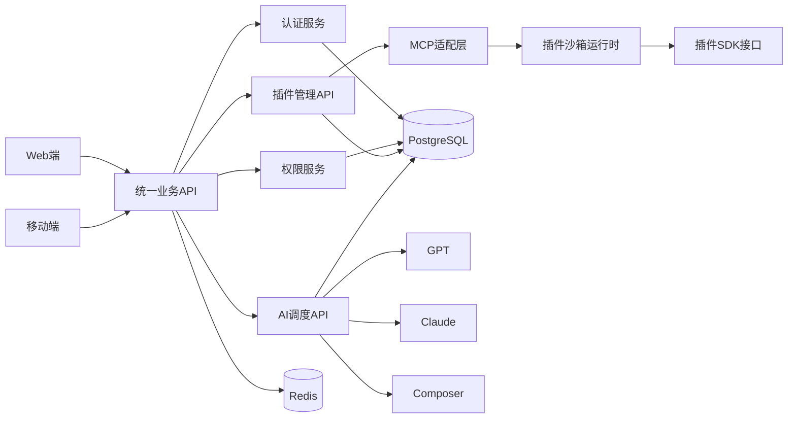
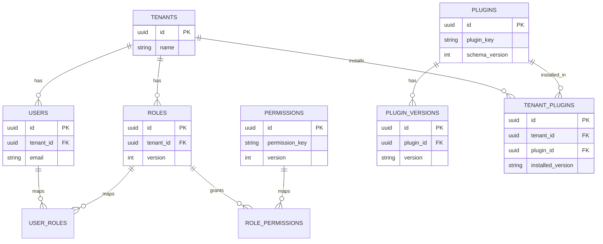

# 阶段一：完整架构设计文档（跨平台插件化 AI 应用）

## 1. 文档目标与范围

本文档用于定义 MVP 阶段的统一技术架构基线，覆盖以下内容：
- 整体技术架构与模块通信路径
- 插件系统规范（接口、协议、沙箱与权限）
- Web 与移动端的适配策略与跨端复用方案
- 数据库与缓存设计（含租户隔离）
- AI 调度层统一封装与推理流程

关键目标：
- 核心平台保持轻量，只承担基础能力
- 业务能力全部插件化，便于行业扩展
- 双端共享业务逻辑，降低维护成本

---

## 2. 整体技术架构图

### 2.1 分层架构与通信路径



设计理由（为什么这样分层）：
- 核心平台与插件解耦：避免业务侵入核心，后续扩展行业插件更快。
- 沙箱单独成层：把第三方插件与核心服务隔离，降低安全风险。
- 双端统一走同一套后端能力：保证行为一致，减少重复实现。

### 2.2 数据流图（用户请求 → 插件加载 → AI 调度 → 数据存储）



### 2.3 模块依赖关系图（核心平台/插件、Web/移动端 API 依赖）



---

## 3. 插件系统规范

### 3.1 插件接口定义（IPlugin）

说明：以下接口包含 5 个生命周期钩子，满足“至少 3 个以上”要求，且覆盖安装、激活、停用、升级、卸载场景。

```ts
export type PluginContext = {
  tenantId: string;
  userId: string;
  logger: { info(msg: string): void; error(msg: string): void };
  api: {
    callAI(input: unknown): Promise<unknown>;
    getConfig(key: string): Promise<string | null>;
    setCache(key: string, value: string, ttlSec?: number): Promise<void>;
  };
};

export interface IPlugin {
  id: string;
  name: string;
  version: string;

  // 安装时执行：初始化配置、校验依赖
  onInstall(ctx: PluginContext): Promise<void>;

  // 激活时执行：注册路由、任务、事件订阅
  onActivate(ctx: PluginContext): Promise<void>;

  // 停用时执行：释放资源、停止任务
  onDeactivate(ctx: PluginContext): Promise<void>;

  // 升级前后执行：迁移配置或缓存结构
  onUpgrade?(ctx: PluginContext, fromVersion: string, toVersion: string): Promise<void>;

  // 卸载时执行：清理插件数据
  onUninstall?(ctx: PluginContext): Promise<void>;
}
```

技术选型理由：
- 统一接口降低插件开发门槛，便于做 SDK 模板化。
- 生命周期完整可控，便于平台审核、回滚和故障隔离。

### 3.2 MCP 通信协议（请求/响应/错误）

#### 请求格式

```json
{
  "request_id": "req_123456",
  "tenant_id": "tenant_a",
  "plugin_id": "plugin.translation",
  "action": "translateProduct",
  "payload": {
    "source_lang": "zh",
    "target_lang": "en",
    "text": "防水登山背包"
  },
  "meta": {
    "user_id": "u_1001",
    "trace_id": "trc_abc",
    "timestamp": 1777000000
  }
}
```

#### 响应格式

```json
{
  "request_id": "req_123456",
  "tenant_id": "tenant_a",
  "plugin_id": "plugin.translation",
  "success": true,
  "data": {
    "translated_text": "Waterproof Hiking Backpack"
  },
  "error": null
}
```

#### 错误格式与处理机制

```json
{
  "request_id": "req_123456",
  "tenant_id": "tenant_a",
  "plugin_id": "plugin.translation",
  "success": false,
  "data": null,
  "error": {
    "code": "PLUGIN_TIMEOUT",
    "message": "插件执行超时",
    "retryable": true
  }
}
```

错误处理原则：
- 可重试错误（如超时、瞬时网络异常）返回 `retryable=true`。
- 不可重试错误（如权限拒绝、参数非法）直接失败并记录审计日志。
- 所有错误必须带 `request_id` 与 `tenant_id`，便于追踪。

### 3.3 沙箱机制（WebAssembly）与白名单 API

沙箱目标：
- 隔离插件代码执行环境
- 限制资源使用（CPU/内存/执行时长）
- 只暴露受控 API，禁止直连数据库和密钥系统

白名单 API（初版）：
- `auth.getCurrentUser()`
- `rbac.hasPermission(permissionKey)`
- `ai.invoke(model, payload)`
- `storage.get(key)` / `storage.set(key, value, ttl)`
- `http.fetch(url, options)`（仅允许白名单域名）
- `market.reportUsage(metric)`

安全边界规则：
- 插件不得直接访问 `PostgreSQL`、`Redis`、模型密钥。
- 插件所有外部调用必须经过核心网关审计。
- 每次插件发布必须绑定权限声明与版本依赖声明。

---

## 4. 双端适配设计

### 4.1 Web 端设计（Next.js 15 App Router）

设计要点：
- 路由分层：`(auth)`、`(dashboard)`、`plugins/[pluginId]`。
- 响应式布局：桌面端多栏，平板和手机自动折叠侧边导航。
- 首屏策略：优先渲染核心信息，插件面板按需加载，减少白屏等待。

技术选型理由：
- App Router 更适合模块化页面组合与后续插件页面挂载。
- Web 端作为后台主操作台，适合展示复杂分析与配置流程。

### 4.2 移动端设计（React Native）

适配策略：
- 手势操作：插件卡片支持左右滑动快捷动作（启用/停用/收藏）。
- 表单简化：复杂表单拆分为多步输入，减少一次性填写负担。
- 渐进式降级：重型分析结果默认摘要显示，详情按需加载。

技术选型理由：
- React Native 可复用 TypeScript 业务层能力，降低双端成本。
- 移动端更强调轻交互与高频操作，策略上优先“快和简”。

### 4.3 跨端复用与差异化

可复用部分（统一）：
- API 调用层
- 鉴权与租户上下文注入
- 插件配置模型与数据校验规则
- AI 请求协议与错误码处理

差异化部分（端侧专属）：
- 页面布局与导航方式
- 手势与交互动效
- 输入组件细节与展示密度

---

## 5. 数据库设计

### 5.1 PostgreSQL 表结构（核心表）

#### 1) 租户表 `tenants`
- `id` (PK)
- `name`
- `status`
- `created_at`
- `updated_at`

#### 2) 用户表 `users`
- `id` (PK)
- `tenant_id` (FK -> tenants.id)  **租户隔离字段**
- `email` (唯一)
- `password_hash`
- `status`
- `created_at`
- `updated_at`

#### 3) 角色表 `roles`
- `id` (PK)
- `tenant_id` (FK -> tenants.id)
- `role_key`
- `role_name`
- `version`  **版本控制字段**
- `created_at`
- `updated_at`

#### 4) 权限表 `permissions`
- `id` (PK)
- `permission_key` (唯一)
- `permission_name`
- `version`  **版本控制字段**
- `created_at`

#### 5) 用户角色关联表 `user_roles`
- `id` (PK)
- `tenant_id` (FK -> tenants.id)
- `user_id` (FK -> users.id)
- `role_id` (FK -> roles.id)
- `created_at`

#### 6) 角色权限关联表 `role_permissions`
- `id` (PK)
- `tenant_id` (FK -> tenants.id)
- `role_id` (FK -> roles.id)
- `permission_id` (FK -> permissions.id)
- `created_at`

#### 7) 插件元数据表 `plugins`
- `id` (PK)
- `plugin_key` (唯一)
- `name`
- `category`
- `owner_developer_id`
- `pricing_type`
- `price`
- `status`
- `latest_version`
- `schema_version`  **版本控制字段**
- `created_at`
- `updated_at`

#### 8) 插件版本表 `plugin_versions`
- `id` (PK)
- `plugin_id` (FK -> plugins.id)
- `version`
- `mcp_protocol_version`
- `wasm_checksum`
- `permissions_manifest`
- `changelog`
- `created_at`

#### 9) 租户插件安装表 `tenant_plugins`
- `id` (PK)
- `tenant_id` (FK -> tenants.id)
- `plugin_id` (FK -> plugins.id)
- `installed_version`
- `status`
- `config_json`
- `created_at`
- `updated_at`

### 5.2 ER 图（含外键与版本字段）



技术选型理由：
- `tenant_id` 贯穿核心业务表，保证多租户隔离。
- 通过 `version/schema_version` 支持权限与插件结构平滑升级。
- 插件版本与插件元数据分离，便于灰度升级和快速回滚。

### 5.3 Redis 用途与 Key 设计

Redis 三类核心用途：
- 会话存储：登录态与短期会话信息
- API 限流：按租户、用户、插件动作维度做限流
- 插件缓存：缓存插件配置、市场列表、分析中间结果

Key 设计示例：
- 会话：`session:{tenant_id}:{user_id}:{token_id}`
- 限流：`ratelimit:{tenant_id}:{user_id}:{api}:{minute}`
- 插件缓存：`plugin_cache:{tenant_id}:{plugin_id}:{key}`
- 插件市场页缓存：`market:list:{page}:{size}:{sort}`

---

## 6. AI 调度层设计

### 6.1 模型封装（GPT / Claude / Composer 统一 API）

统一调用入口（逻辑）：
- 输入：`tenant_id`、`plugin_id`、`task_type`、`payload`
- 处理：模型路由选择、密钥注入、配额校验、审计记录
- 输出：标准化结果与统一错误码

关键能力：
- 密钥管理：密钥仅存储在服务端安全配置，不下发端侧
- 配额控制：按租户 + 插件 + 模型三维度进行额度限制
- 用量统计：记录 token/请求数/失败率，支持后续计费与告警

技术选型理由：
- 统一网关可避免各插件各自接模型造成治理失控。
- 后续新增模型只改一处，不影响插件调用方式。

### 6.2 请求处理流程（端侧轻量、服务端推理）

```mermaid
flowchart LR
    C[客户端(Web/移动)] --> G[核心API网关]
    G --> P[插件运行时]
    P --> AI[AI调度服务]
    AI --> K[密钥管理]
    AI --> Q[配额校验]
    AI --> M[模型服务]
    M --> AI
    AI --> P
    P --> DB[(PostgreSQL tenant_id隔离)]
    P --> R[(Redis缓存)]
    P --> G
    G --> C
```

流程说明：
1. 客户端只负责提交业务请求，不做重型推理。
2. 核心服务完成鉴权、插件路由与 AI 调度。
3. 推理结果由插件进行业务封装后写入存储并返回端侧。

---

## 7. 关键技术决策与理由（汇总）

1) 采用“轻量核心 + 插件生态”  
- 理由：降低核心复杂度，保证未来多行业扩展速度。

2) 采用 WebAssembly 沙箱运行插件  
- 理由：在开放插件市场前提下，提供执行隔离与权限控制。

3) 采用 Next.js 15 + React Native 双端组合  
- 理由：共享 TypeScript 业务模型，兼顾 Web 复杂场景与移动高频场景。

4) 采用 FastAPI 统一承接 AI 调度  
- 理由：集中管理密钥、配额、审计，提升稳定性与可运营性。

5) 数据层采用 PostgreSQL + Redis  
- 理由：关系数据强一致 + 高性能缓存限流，适配平台型系统常见负载。

---

## 8. 阶段一验收对照

- 架构图是否标注沙箱边界：已标注（“插件沙箱层（WebAssembly 边界）”）。
- 架构图是否标注通信通道：已标注（BFF、MCP、AI 调度、数据连接）。
- 架构图是否标注数据隔离字段：已标注（PostgreSQL 中 `tenant_id`）。
- 插件接口是否包含 3 个以上生命周期钩子示例：已提供 5 个。
- 数据库 ER 图是否包含外键关系与版本字段：已包含（FK 与 `version/schema_version`）。

---

## 9. 下一步（进入阶段二前建议）

- 先冻结本架构文档版本为 `v1.0`，作为开发基线。
- 再按模块拆分代码骨架：`core/`、`plugins/`、`web/`。
- 同步输出接口契约文件，确保前后端并行开发不跑偏。
